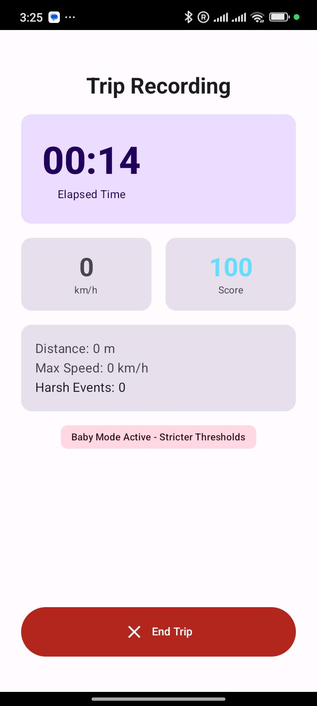

<p align="center">
  <a href="https://ntufar.github.io/BabyOnBoard/" target="_blank" rel="noopener">
    
  </a>
</p>

# Baby on Board — Safe-Driving Telemetry for Families

<p align="center">
  <a href="https://github.com/ntufar/BabyOnBoard/actions/workflows/ci.yml"></a>
  <a href="https://github.com/ntufar/BabyOnBoard/actions/workflows/release.yml"></a>
  <a href="https://github.com/ntufar/BabyOnBoard/actions/workflows/deploy-web.yml"></a>
  <a href="https://ntufar.github.io/BabyOnBoard/"></a>
  <a href="https://play.google.com/store/apps/details?id=io.github.ntufar.babyonboard"></a>
  
  
  
  <a href="https://github.com/ntufar/BabyOnBoard/releases"></a>
</p>

Baby on Board is an Android-native application that uses on-device sensor fusion (GNSS, accelerometer, gyroscope) to provide parents and caregivers with clear, non-judgmental telemetry on driving smoothness and safety. All processing stays on-device — no raw sensor data is transmitted.

## Key Features

- **Driving Telemetry Engine** — Real-time monitoring of speed, hard braking, hard acceleration, and cornering via sensor fusion.
- **Baby Mode** — User-activated stricter safety thresholds that prioritize smoothness and jerk reduction for infant comfort.
- **Safe-Driving Score** — 0–100 score computed from harsh-event rate per 100 km, jerk, and speed smoothness; normalized by trip distance.
- **Crash Detection & SOS** — Best-effort crash detection with a user-cancellable 60-second countdown before alerting emergency contacts and dialing 112.
- **Back-Seat Reminder** — A prominent "check the back seat" notification at trip end when Baby Mode was active; a backstop, not a guarantee.
- **Encrypted Storage** — All trip data encrypted at rest via SQLCipher.
- **Privacy First** — All telemetry computation on-device. No account required. Export and delete data anytime.

## Screenshot

<p align="center">
  
</p>

## Tech Stack

| Layer | Technology |
|---|---|
| Language | Kotlin 1.9.20 |
| UI | Jetpack Compose (Material 3) |
| Architecture | Clean Architecture + MVVM |
| DI | Hilt |
| Persistence | Room (SQLCipher encrypted), DataStore |
| Concurrency | Coroutines & Flow (1.7.3) |
| Background | Foreground Service |
| Sensors | GNSS, Accelerometer, Gyroscope, Rotation Vector |
| CI/CD | GitHub Actions (lint, test, build, deploy) |
| Min / Target SDK | 26 / 35 |

## Architecture Overview

```
app/
├── domain/          Pure Kotlin use-cases and models
├── data/            Repositories, Room DAOs, DataSources
├── sensing/         High-frequency sensor acquisition, Telemetry Engine, world-frame rotation
└── ui/              Compose screens, ViewModels (StateFlow), navigation
```

- **Domain layer** — no Android dependencies; contains `EvaluateCrashUseCase`, scoring logic, and event models.
- **Data layer** — Room DAOs with SQLCipher encryption, `DataStore` preferences, repository pattern.
- **Sensing layer** — `SensorService` for high-frequency acquisition, `TelemetryEngine` for real-time event detection, world-frame rotation via rotation vector sensor.
- **UI layer** — Compose screens driven by `StateFlow` ViewModels; supports onboarding, live trip, trip history, settings, SOS countdown.

## Testing

- **Unit tests** — `EvaluateCrashUseCase`, `TelemetryEngine`, `SensorEmulation`, ViewModels (Robolectric).
- **CI** — Every push runs lint, unit tests, and debug build via GitHub Actions.
- **Coverage** — 99 tests covering crash detection, sensor fusion, back-seat reminder, and scoring.

## Getting Started

**Prerequisites:** JDK 17+, Android Studio Hedgehog (2023.1.1+).

```bash
git clone https://github.com/ntufar/BabyOnBoard.git
```

Open in Android Studio, sync Gradle, and run on a physical Android device (sensors required; emulator will not provide accelerometer/gyroscope data).

### Build & Test

```bash
./gradlew lint             # Static analysis
./gradlew test             # Unit tests
./gradlew assembleDebug    # Debug APK
```

## Contributing

See [CONTRIBUTING.md](CONTRIBUTING.md) — all new features must include tests.

## Roadmap

- [x] MVP: Telemetry Engine, Baby Mode, Trip History, Local Persistence
- [ ] v1.1: Road roughness, gradient detection, arrival sharing
- [ ] v1.2: On-device ML scoring and cloud sync

## License

MIT — see [LICENSE](LICENSE) for details.
